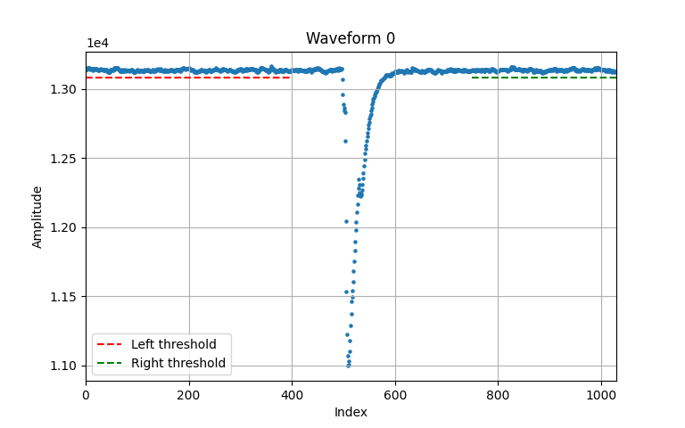

# The Methods
## Cleaning up the Waveforms
To ensure the accuracy of our analysis, we needed to exclude the effects of Dark Count Rates (DCRs) from the waveforms. Here's how we accomplished this:

1. **Baseline Selection**: We began by selecting a waveform without DCR, which happened to be the first one in our dataset.

2. **Determining Baseline Ranges**: Using visual inspection, we identified the ranges representing the baseline on both sides of the waveform. For the left side, we chose the range \\([0, 400)\\), and for the right side, we selected \\([750, 1030)\\). These ranges captured the portions of the waveform containing only noise, leaving out the pulse signal.

3. **Threshold Calculation**: Next, we calculated a threshold value to identify DCRs. Let \\( B \\) denote the set of baseline points derived from the selected ranges. We defined the threshold (\\( T \\)) as:
   \\[ T = \mu_B - n \times \sigma_B \\]
   Here, \\( \mu_B \\) represents the mean and \\( \sigma_B \\) the standard deviation of the baseline points. We chose an arbitrary value for \\( n \\) (7 in our case) to set the threshold.

4. **Discarding DCR-containing Waveforms**: Using the threshold calculated in the previous step, we discarded any waveform that had at least one point exceeding the threshold within the specified baseline ranges. As a result, we retained approximately \\( 8 \times 10^4 \\) waveforms suitable for further analysis.

Below, the first waveform: 

    

## Determining Baseline Correspondence
After cleaning up the waveforms to remove the effects of Dark Count Rates (DCRs), our next objective was to understand the relationship between the baseline portions on the left and right sides of the waveforms. Here's how we approached this task:

1. **Calculating Mean and Variance**: For each waveform, we computed the mean values (\\( \mu_l \\) and \\( \mu_r \\)) for the left and right baseline portions, respectively. Additionally, we determined the variance (\\( \sigma_{l}^2 \\) and \\( \sigma_{r}^2 \\)) of each portion.

2. **Quantifying Difference**: To quantify the difference between the left and right baseline portions, we calculated the delta (\\( \Delta \\)) in terms of sigma (\\( \sigma \\)):
   \\[ \Delta = \frac{\mu_l - \mu_r}{\sqrt{\sigma_{l}^2 + \sigma_{r}^2}} \\]
   This step allowed us to obtain a vector of delta values (\\( \Delta_0, \Delta_1, \ldots, \Delta_n \\)) for all waveforms.

3. **Visualizing Delta Values**: We created a scatter plot of the delta values to visually examine the relationship between the baseline portions. This plot helped us identify any patterns or trends in the data.

4. **Analyzing Distribution**: Additionally, we generated a histogram of the delta values to understand the distribution of differences between the left and right baseline portions across all waveforms.

By performing these analyses, we aimed to gain insights into the consistency and symmetry of the baseline portions within the waveforms. Understanding the correspondence between these portions is crucial for assessing the stability and reliability of the SiPM signals. Moreover, it provides valuable information for further refinement of our analysis techniques and optimization of signal extraction methods.

## Exploring Ergodicity in the Waveform Data

We embarked on analyzing the ergodicity of the waveform data through the following steps:

1. Focusing solely on the left side baseline correspondence, we initiated our analysis by examining the mean and variance of the left baseline portion for each waveform, denoted as \\( \mu_{l} \\) and \\( \sigma_{l}^2 \\), respectively.

2. To gain further insights, we transformed the waveform matrix by transposing it. This rearrangement represented each row as a sample event rather than an individual waveform. Consequently, we calculated the mean ( \\( \mu_{l}^T \\) ) and variance ( \\( {\sigma_{l}^{2}}^T \\) ) of the transposed left baseline.

3. We visualized the distribution of mean and standard deviation values for the non-transposed matrix through two histograms.

4. Additionally, we plotted trend plots to depict the trends of mean values for both the transposed ( \\( \mu_{l}^T \\) ) and non-transposed ( \\( \mu_{l} \\) ) left baseline portions. These plots provided a graphical representation of the baseline characteristics across sample events and individual waveforms, facilitating comparative analysis and trend identification.

####
> The part below NEEDS editing.

### Iterative Procedure
To systematically assess the correlation structure among the baseline datapoints, we employ an iterative approach. The verification process begins with an assumption regarding the noise dataset size, which we start supposing is \\( N = 400 \\). The verification proceeds iteratively as follows:
- At the initial iteration, \\( j = 1 \\), each single data point is considered as a chunk. Therefore, the relationship \\( v = v_i \\) holds. We then calculate the standard deviation of these 400 data point, \\( \sigma_{1,j} \\). So we end up having \\( N \\) columns.
- For \\( j > 1 \\), the chunk size increases by 1, while the number of chunks decreases by half. Thus a new relationship holds: \\( jv = \sum v_i \\). This means that data are grouped as chunks of size \\( j \\), so we end up with a halved number of data points at each iteration. Each element of a chunk has the form \\( \sum v_i \\). Then we compute the standard deviation, \\( \sigma_{n,j} \\).

By increasing the chunk size with each iteration and halving the number of chunks, we gradually explore the correlation structure within the dataset, allowing for a more comprehensive analysis. 

> This has to be done for each waveform.

### Standard deviations
Once the standard deviations for each iteration and for each baseline have been computed, they are organized into a matrix structure for further analysis:

\\[
    \begin{bmatrix}
    \sigma_{1,1} & \sigma_{1,2} & \cdots & \sigma_{1,N} \newline
    \sigma_{2,1} & \sigma_{2,2} & \cdots & \sigma_{2,N} \newline
    \vdots & \vdots & \ddots & \vdots \newline
    \sigma_{k,1} & \sigma_{k,2} & \cdots & \sigma_{k,N} \newline
    \end{bmatrix}   
\\]

In this matrix, each row corresponds to the standard deviations calculated for one waveform, while each column represents the different standard deviations for a given chunk factor.

After organizing the standard deviations, the next step is to calculate the average standard deviation for column of the matrix above. This provides a measure of the overall variability of each data point throughout the iterative process. The formula for calculating the average standard deviation for each column \\( j \\) is given by:
\\[
    \bar{\sigma_{j}} = \frac{1}{k} \sum_{i,j} \sigma_{i,j}  
\\]
Here, \\( \sigma_{i,j} \\) denotes the standard deviation for data point \\( j \\) at iteration \\( i \\).
We then end up having a vector of mean standard deviations:

\\[
    \begin{bmatrix}
    \bar{\sigma_{1}} & \bar{\sigma_{2}} & \cdots & \bar{\sigma_{N}}
    \end{bmatrix}   
\\]
The next step is to calculate the standard deviation for column of the matrix above as:

\\[
    std(j, \bar{\sigma}) = \sqrt{ \frac{1}{k} \sum_{k}^{j} (\bar{\sigma_j} - \sigma_{k,j}) }
\\]

Then, we need to calculate te standard deviations of the mean stds, which is done as follows:

\\[
    \begin{bmatrix}
    \frac{std(j, \bar{\sigma})}{\sqrt{k}} & \frac{std(j, \bar{\sigma})}{\sqrt{k}} & \cdots & \frac{std(j, \bar{\sigma})}{\sqrt{k}}
    \end{bmatrix}   
\\]

The average standard deviations serve as important metrics for understanding the overall trend and variability of the dataset across different iterations. These values are then utilized to plot error bars for each data point in the final trend plot. In the plot, the y-axis represents the variance, while the x-axis corresponds to the number of chunks. By visualizing the trend with error bars, we gain insights into the stability and consistency of the dataset over the iterative analysis process.