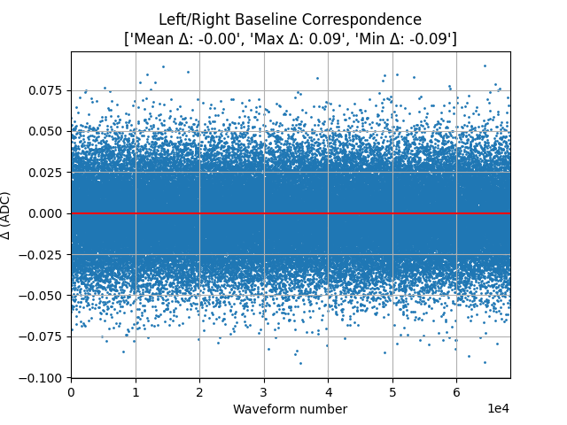
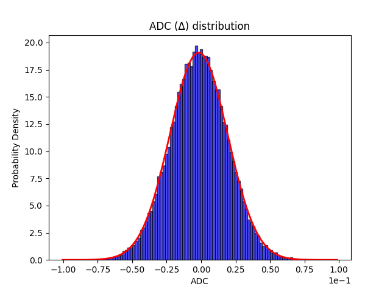
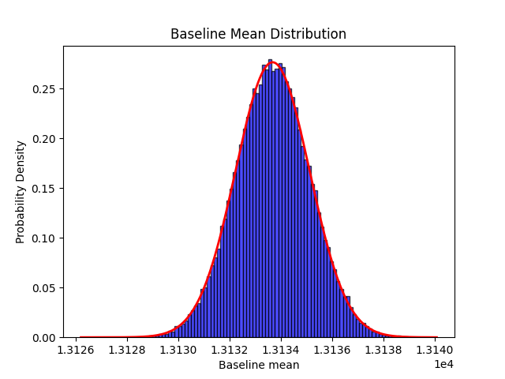
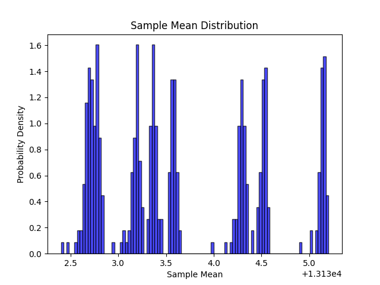
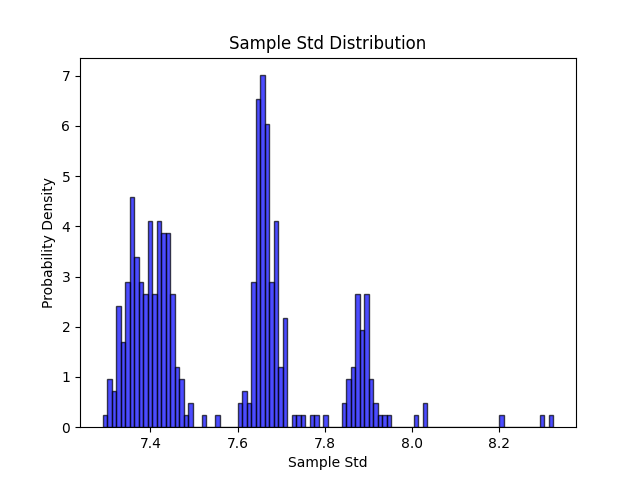
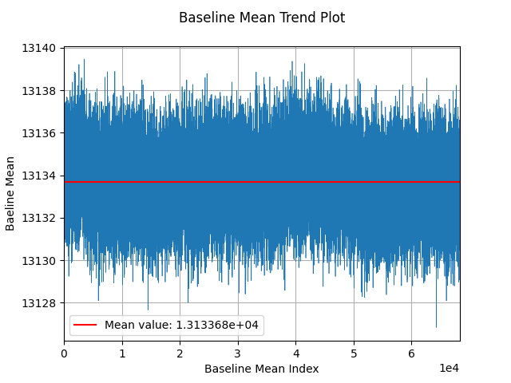
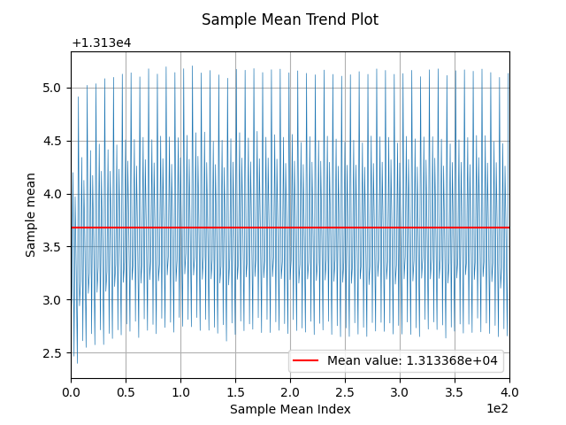

# The Results
## Baseline Correspondence

    

The scatter plot above illustrates the distribution of \\( \Delta \\) values across all waveforms, representing the difference in mean values between the left and right baseline portions. Observing that the majority of \\( \Delta \\) values are centered around zero with low dispersion, we can infer a consistent correspondence between the mean values of the two baseline portions. This suggests a symmetrical distribution of noise levels across the waveform baseline, indicating stability and uniformity in signal characteristics.

However, it's important to note that while the majority of \\( \Delta \\) values cluster around zero, there are outliers with larger deviations. These outliers may indicate instances where the baseline segments diverge significantly, potentially due to noise artifacts or other anomalous factors. Further investigation into these outliers could provide insights into underlying signal variations or experimental conditions.

Additionally, while the scatter plot provides valuable insight into the overall distribution of \\( \Delta \\) values, it may not capture more nuanced patterns or trends within the data. Employing additional statistical techniques, such as hypothesis testing or regression analysis, could offer a more comprehensive understanding of the relationship between baseline segments.

Overall, the scatter plot serves as a preliminary assessment of baseline correspondence, highlighting areas of consistency and potential variability within the waveform data. Further analysis and validation are recommended to confirm the robustness of these findings and their implications for signal characterization and interpretation.

    

Furthermore, we proceeded by plotting the ADC distribution and a closer examination reveals a central tendency around zero, with a symmetrical and bell-shaped appearance reminiscent of a Gaussian distribution. This observation suggests a normal correspondence between the mean values of the two baseline portions, further supporting the notion of consistent signal characteristics across the waveform baseline.

The resemblance to a Gaussian distribution implies that the noise levels within the baseline segments exhibit typical statistical properties, reinforcing the notion of stability and uniformity in signal behavior. However, it's essential to acknowledge potential deviations from ideal Gaussian behavior, which may arise due to factors such as measurement error, environmental interference, or instrumental limitations.

By identifying the normal distribution pattern within the ADC values, we gain confidence in the reliability and accuracy of the baseline correspondence analysis. This finding strengthens our understanding of the underlying signal dynamics and enhances the validity of subsequent data interpretation and analysis.

## Ergodicity in the Waveform Data

### Distributions
The following two distributions are related to the waveform matrix:

    

We can observe a bell-shaped distribution, which resembles the Gaussian distribution, even though its a bit narrower. This indicates a normal and even distribution of mean values, even though the distribution is not perfectly centered.

    

    

    

### Trend Plots

    

    

